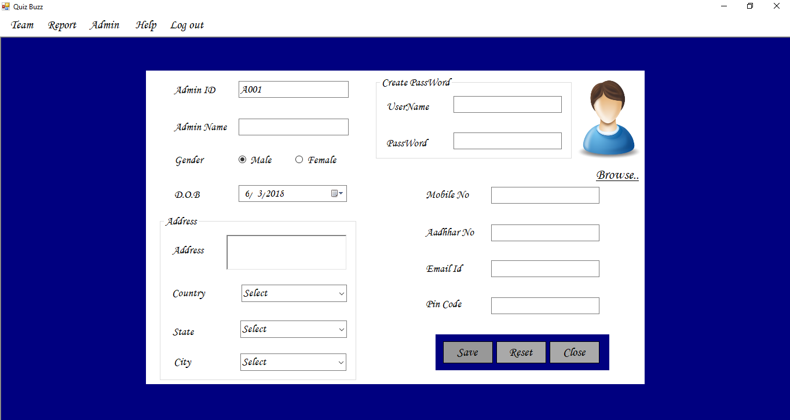
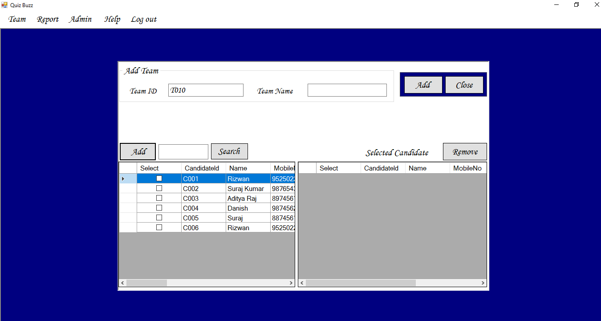
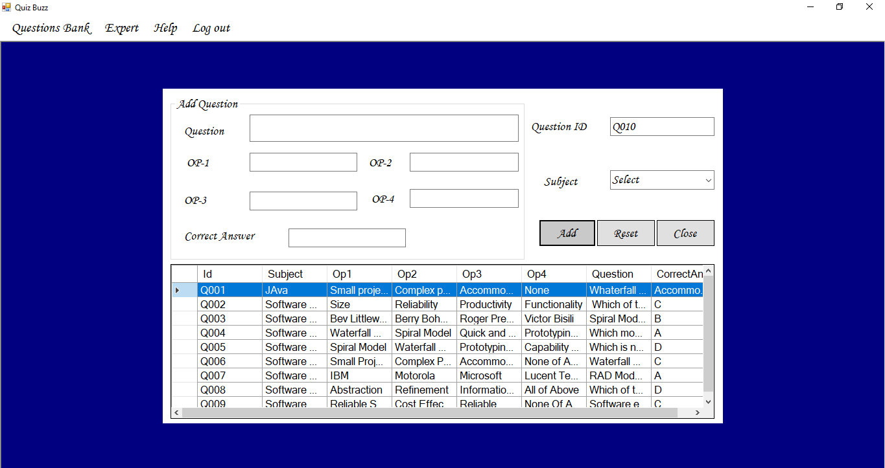
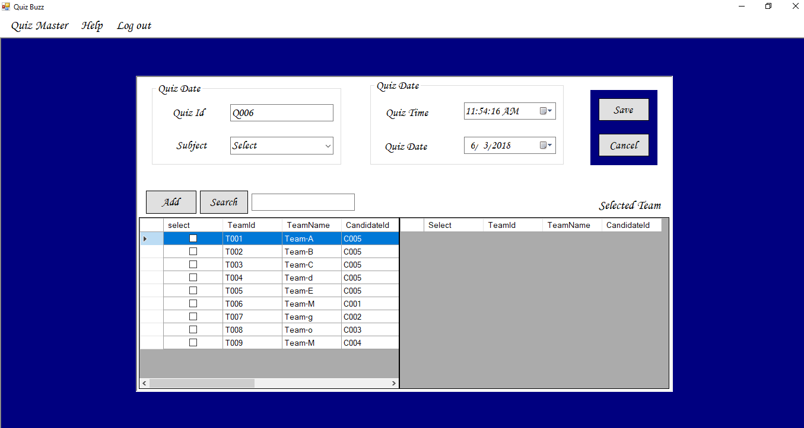
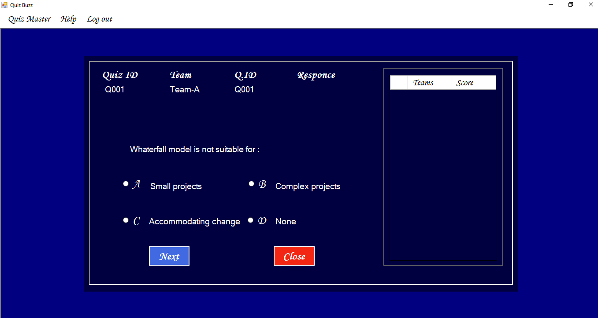

# QuizBuzz
Quiz (Question Under Intelligent Zone). A quiz is a form of game or mind sport, in which the players (as in teams) attempt to answer questions correctly. It is a game to test your knowledge about a certain subject. In some countries, a Quiz is also a brief assessment used in education and similar field to measure growth in knowledge, abilities, and-1/or skills.
# Login Page

# Home Page

# Add Team Page

# Add Questios Page

# Quiz Date Page

# Quiz Page

